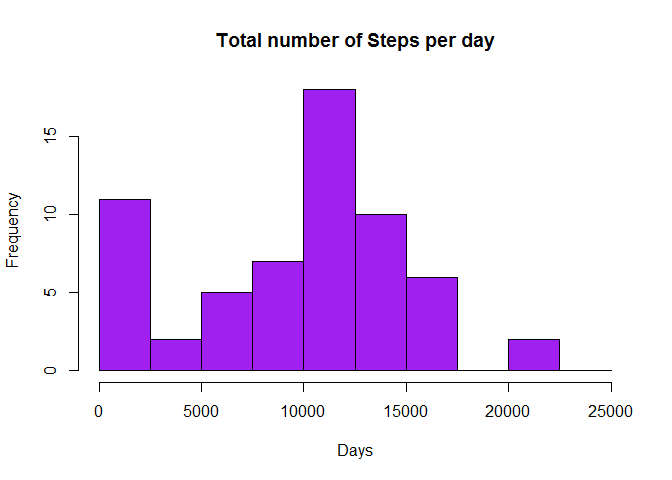

# Reproducible Research: Peer Assessment 1


## Loading and preprocessing the data

```r
unzip("C:\\Users\\SHRUTI\\Documents\\repdata_data_activity.zip")
activity<-read.csv("C:\\Users\\SHRUTI\\Documents\\activity.csv")
```
## What is mean total number of steps taken per day?

```r
dat<-data.frame()
#1. Mean and median of total number of steps per day
totalsteps<-rep(NA,61)
date<-rep(NA,61)
steps_date<-tapply(activity$steps,activity$date,sum,na.rm=T)
for (i in 1:61){
  totalsteps[i]<-steps_date[[i]]
  date[i]<-names(steps_date)[i] 
}
dat<-data.frame(date,totalsteps)
hist(dat$totalsteps, breaks=seq(from=0, to=25000, by=2500),main="Total number of Steps per day",xlab= "Days",col="purple")
```

 

```r
mean(dat$totalsteps)
```

```
## [1] 9354.23
```

```r
median(dat$totalsteps)
```

```
## [1] 10395
```

## What is the average daily activity pattern?

###Time Series across intervals

```r
interval<-tapply(activity$steps,activity$interval,mean,na.rm=T)
plot(row.names(interval), interval, type = "l", xlab = "5-min interval", 
     ylab = "Average across all Days", main = "Average number of steps taken", 
     col = "blue",lwd=3)
```

 

```r
interval_maxsteps<-which.max(interval)
names(interval_maxsteps)
```

```
## [1] "835"
```

## Inputing missing values

```r
num_na<-sum(is.na(activity))
num_na
```

```
## [1] 2304
```

```r
averagesteps<-aggregate(steps~interval,data=activity,FUN=mean)
reqNAval<-numeric()
for(i in 1:nrow(activity)){
  reqrow<-activity[i,]
  if (is.na(reqrow$steps)){
    steps<-subset(averagesteps,interval==reqrow$interval)$steps
  }
  else{
    steps<-reqrow$steps

  }
  reqNAval<-c(reqNAval,steps)
}

activity_modified<-activity
activity_modified$steps<-reqNAval

totalsteps2<-rep(NA,61)
date2<-rep(NA,61)
steps_date2<-tapply(activity_modified$steps,activity_modified$date,sum,na.rm=T)
for (i in 1:61){
  totalsteps2[i]<-steps_date2[[i]]
  date2[i]<-names(steps_date2)[i] 
}
dat2<-data.frame(date2,totalsteps2)

hist(dat2$totalsteps2, breaks=seq(from=0, to=25000, by=2500), main="Total number of Steps per day with replaced NA values",xlab= "Days",col="green")
```

 

```r
mean(dat2$totalsteps2)
```

```
## [1] 10766.19
```

```r
median(dat2$totalsteps2)
```

```
## [1] 10766.19
```
## Are there differences in activity patterns between weekdays and weekends?
###Differences in patterns in weekdays and weekends

```r
library(date)
```

```
## Warning: package 'date' was built under R version 3.1.3
```

```r
activity_modified$date<-as.character(activity_modified$date)
activity_modified$date<-as.Date(activity_modified$date,"%Y-%m-%d")
day<-weekdays(activity_modified$date)
level_ident<-vector()

for(i in 1:nrow(activity_modified)){
  if (day[i]=="Saturday"){
    level_ident[i]<-"Weekend"
  }else if(day[i]=="Sunday"){
    level_ident[i]<-"Weekend"
  }else {level_ident[i]<-"Weekday"}
}

activity_modified$level_ident<-level_ident
activity_modified$level_ident<-factor(activity_modified$level_ident)
Stepsperday<-aggregate(steps~interval+level_ident,data=activity_modified,mean)
names(Stepsperday)<-c("interval","day","steps")
library(ggplot2)
```

```
## Warning: package 'ggplot2' was built under R version 3.1.3
```

```r
ggplot(data=Stepsperday,aes(x=interval,y=steps))+
  geom_line(color="magenta")+
  facet_grid(day~.)+
  labs(x="5-min Interval",y="Average Steps taken per day",title="Activity Patterns in Weekdays and Weekends")
```

 
